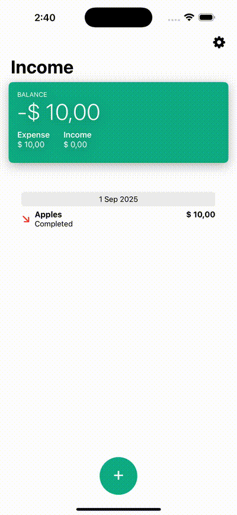

# 📱 Income (SwiftUI Practice)

Este proyecto es un **ejercicio personal de práctica** con SwiftUI y iOS.  
El objetivo es experimentar con componentes como formularios, listas, navegación y bindings, sin un alcance de producto real.

---

## 🧩 Contenido

- `HomeView`: vista principal con balance y listado de transacciones.  
- `AddTransactionView`: formulario para crear o editar transacciones.  
- `TransactionView`: celda reutilizable para mostrar cada transacción.  

---

## 🎥 Demo

<p align="center">
  
</p>

*(El GIF se generó a partir de una grabación en el simulador de iOS)*  

---

## 🛠️ Tecnologías

- Swift  
- SwiftUI  
- Xcode  

---

## 🚀 Ejecución

1. Clonar el repo:
   ```bash
   git clone https://github.com/stleye/income.git
   cd income
# swiftui_todolist_app-
